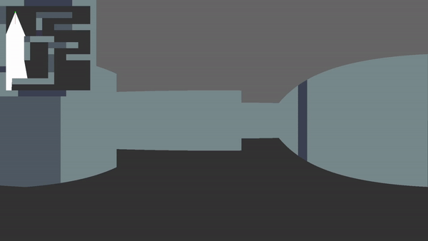

# Raycaster

This project is a renderer using the raycasting rendering technique. 
This rendering technique takes a 2d image and casts out rays from a camera position on order to create a pseudo-3D view.
The rays are first tested for intersections with lines on the image to see where each hit occurs.
The lines are then drawn in the first-person view where the height of the line is relative to the distance from the ray origin to the hit point

# Technologies Used
- C++17
- OpenGL 3.3
- GLFW
- GLSL

# Preview
In this example the image used for raycasting is in the top left of the screen

